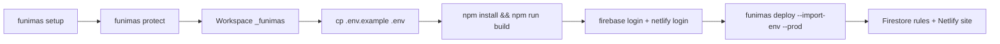

# Funimas

Herramienta de línea de comandos que protege proyectos con Firebase/Firestore. Analiza el código, crea una copia de trabajo segura y mueve el acceso a datos al servidor **sin tocar los archivos originales**.

Funciona con **cualquier repositorio** que cumpla los requisitos de abajo (React, Vite, Next, etc.). No está limitado a un solo proyecto.

## ¿Qué necesitas antes de empezar?

1. **Node.js** 20 o superior (`node --version`)
2. **Git**
3. Una **terminal**

## Instalación (solo la primera vez)

```bash
git clone https://github.com/robinson19937/funimas.git
cd funimas
npm install
npm run build
npm link
```

> Si `npm link` da error de permisos:
>
> ```bash
> node dist/cli/index.js protect ./ruta-de-tu-proyecto
> ```

## Comandos CLI

| Comando | Descripción |
| ------- | ----------- |
| `funimas setup` | Verifica prerequisitos (Node, Git, Firebase CLI, Netlify CLI) |
| `funimas protect <ruta>` | Analiza el proyecto y genera el workspace protegido |
| `funimas deploy [workspace] [opciones]` | Despliega reglas Firestore y sitio Netlify |

### Verificar entorno

```bash
funimas setup
```

Comprueba Node.js, Git y las CLIs opcionales. **No necesitas instalar Firebase ni Netlify globalmente**: `funimas deploy` usa `npx firebase-tools@latest` y `npx netlify-cli@latest` automáticamente.

### Proteger un proyecto

```bash
funimas protect ./ruta-de-tu-proyecto
```

**Ejemplos incluidos:**

```bash
funimas protect ./examples/react-firebase-crud
funimas protect ./examples/tenis-monorepo/tenis
```

### Desplegar a producción

```bash
cd <proyecto>_funimas
cp .env.example .env          # completa credenciales Firebase + service account
npm install
npm run build

# Autenticación (solo la primera vez)
npx firebase-tools@latest login
npx netlify-cli@latest login

# Despliegue completo: reglas Firestore + sitio Netlify
funimas deploy . --import-env --prod
```

**Opciones de `deploy`:**

| Opción | Descripción |
| ------ | ----------- |
| `--prod` | Despliegue a producción en Netlify |
| `--import-env` | Importa variables desde `.env` a Netlify (`netlify env:import`) |
| `--skip-firestore` | Omite `firebase deploy --only firestore:rules` |
| `--skip-netlify` | Omite `netlify deploy` |
| `--dry-run` | Muestra los comandos sin ejecutarlos |

---

## Flujo completo (protección → producción)



---

## ¿Qué hace `funimas protect`?

1. Crea **backup** en `<proyecto>/.funimas/backups/`
2. Genera el workspace **`<proyecto>_funimas/`** (aquí ocurren todos los cambios)
3. Analiza el código y aplica transformaciones automáticas
4. **Genera configuración de despliegue** (ver tabla abajo)
5. Escribe informes en `<proyecto>/.funimas/reports/`

**El proyecto original no se modifica.**

| Qué buscas | Dónde está |
| ---------- | ---------- |
| Proyecto listo para desplegar | `<proyecto>_funimas/` |
| Backup | `<proyecto>/.funimas/backups/` |
| Informe de cambios | `<proyecto>/.funimas/reports/summary.json` |

---

## Requisitos del proyecto a analizar

| Requisito | Obligatorio |
| --------- | ----------- |
| Código TypeScript o JavaScript | Sí |
| `netlify.toml` en la raíz (o monorepo) | Sí (despliegue en Netlify) |
| Uso de Firebase/Firestore en el cliente | Sí |

### Qué transforma hoy (automático)

| Operación detectada | Qué hace Funimas |
| ------------------- | ---------------- |
| `addDoc()` | Reescribe a `Funimas.database.insert()` y enruta al servidor |

### Qué aún requiere migración manual en tu código

Si tu app usa estas APIs de Firestore en el cliente, **debes cambiarlas tú** al SDK (o dejar que Funimas las soporte en una versión futura):

- `getDoc` / `getDocs` → `Funimas.database.fetchClubDocument()` (o equivalente)
- `setDoc` / `updateDoc` / `runTransaction` → `Funimas.database.mutateClubDocument()` con acciones tipadas
- `onSnapshot` → `Funimas.database.pollClubDocument()` (polling en v1)

Ver el ejemplo completo en `examples/tenis-monorepo/tenis/src/lib/firestoreClub.ts`.

---

## Archivos que genera Funimas (nuevos)

En `<proyecto>_funimas/` se crean:

```
shared/                          # Lógica de negocio compartida (autorización, mutaciones)
runtime/
  handler.ts                     # Punto de entrada del servidor
  router.ts                        # Rutas HTTP /api/*
  middleware/authMiddleware.ts     # Verificación de Firebase ID token
  middleware/authorization.ts    # Reglas de negocio
  controllers/clubsController.ts
  repositories/firestoreRepository.ts  # Firebase Admin SDK (Firestore real)
sdk/
  index.ts                         # export const Funimas / configureFunimas
  database/DatabaseClient.ts       # Cliente HTTP con Bearer token
netlify/functions/
  funimas.ts                       # Handler principal (/api/clubs/*, /api/insert)
  database_insert.ts               # Compatibilidad con rewrites addDoc()
firestore.rules                    # Reglas generadas (escrituras cliente bloqueadas)
firebase.json                      # Config para firebase deploy --only firestore:rules
.env.example                       # Plantilla de variables de entorno
src/types/netlify.d.ts             # (o types/netlify.d.ts)
src/types/firebase-admin.d.ts      # Stubs para validación TypeScript
```

También actualiza en el workspace:

- `tsconfig.json` — paths `@funimas/sdk`, `@funimas/shared`
- `package.json` — añade `@netlify/functions`, `firebase-admin`, `@types/node`
- `netlify.toml` — añade redirects `/api/*` y config de functions si faltan

## Archivos que modifica Funimas (en el workspace)

Solo los archivos de tu app donde detecta operaciones transformables. Hoy:

- Archivos con `addDoc(...)` → sustituidos por `Funimas.database.insert(...)` + import de `@funimas/sdk`

El resto de tu código **no se toca**. Revisa siempre `.funimas/reports/changes.md` después de `protect`.

---

## Despliegue: qué es automático y qué requiere credenciales

### Generado automáticamente por `funimas protect`

| Artefacto | Qué hace |
| --------- | -------- |
| `netlify.toml` | Parchea redirects `/api/*` → `funimas` y `[functions]` con `firebase-admin` |
| `firestore.rules` | Bloquea escrituras directas del cliente por colección detectada |
| `firebase.json` | Apunta a `firestore.rules` para `firebase deploy` |
| `.env.example` | Lista todas las variables necesarias |

### Variables de entorno (una sola vez)

Copia la plantilla y completa tus credenciales:

```bash
cd <proyecto>_funimas
cp .env.example .env
```

| Variable | Dónde se usa | Descripción |
| -------- | ------------ | ----------- |
| `FIREBASE_PROJECT_ID` | Servidor | ID del proyecto Firebase |
| `FIREBASE_CLIENT_EMAIL` | Servidor | Email del service account |
| `FIREBASE_PRIVATE_KEY` | Servidor | Clave privada (con `\n` escapados) |
| `VITE_FIREBASE_API_KEY` | Cliente | Config Firebase Auth |
| `VITE_FIREBASE_AUTH_DOMAIN` | Cliente | Dominio Auth |
| `VITE_FIREBASE_PROJECT_ID` | Cliente | Mismo project ID |
| `VITE_FUNIMAS_API_URL` | Cliente | `/api` en producción (por defecto) |

Con `--import-env`, `funimas deploy` ejecuta `netlify env:import .env` para subir las variables del servidor a Netlify sin configuración manual en el dashboard.

### Reglas de Firestore

Funimas genera reglas restrictivas por colección detectada en tu código:

```
allow read: if request.auth != null;
allow create, update, delete: if false;   # solo Admin SDK escribe
```

El despliegue se hace con:

```bash
funimas deploy . --skip-netlify          # solo reglas
# o incluido en el deploy completo:
funimas deploy . --import-env --prod
```

Internamente ejecuta `npx firebase-tools@latest deploy --only firestore:rules --project <FIREBASE_PROJECT_ID>` (lee el project ID desde `.env`).

### Autenticación CLI (primera vez)

```bash
npx firebase-tools@latest login
npx netlify-cli@latest login
```

### Despliegue Netlify

```bash
funimas deploy <proyecto>_funimas --prod
```

Equivalente a `npx netlify-cli@latest deploy --prod` desde el workspace, con validación previa de `firebase.json` y `firestore.rules`.

---

## Flujo de datos después de proteger

```
React (cliente)
  → Firebase Auth (signIn, getIdToken)     ← sigue en el cliente
  → @funimas/sdk (Authorization: Bearer)
  → Netlify Function funimas.ts
  → runtime/ + Firebase Admin SDK
  → Firestore
```

---

## Scripts de desarrollo (repo Funimas)

| Script  | Descripción |
| ------- | ----------- |
| `dev`   | CLI en modo desarrollo |
| `build` | Compila TypeScript |
| `test`  | Pruebas (Vitest) |
| `lint`  | ESLint |

## Estructura del repo Funimas (herramienta CLI)

```
src/
  cli/           Comandos: setup, protect, deploy
  deploy/        Orquestación Firebase + Netlify CLI
  generator/     Generadores de config, reglas y entorno
  pipeline/      Pipeline de protección
templates/       Plantillas runtime, SDK, firestore.rules, .env
examples/        Proyectos de referencia (react-firebase-crud, tenis-monorepo)
tests/           Pruebas unitarias
```

## Licencia

MIT
